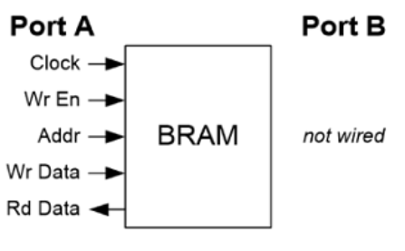
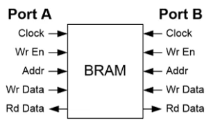
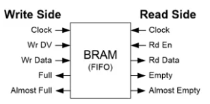

# Block RAM (BRAM)

## What is a BRAM ?
It is internal memory block inside FPGA. 
  - It is used to store large amount of data inside FPGA board
  - Helps in faster read/write operation.
  - Used commonly for FIFOs, Image processing, lookup tables and storing data in DSP system 

## Why we need to use BRAM?
Using registers for large memory is waste of FPGA logic resources.
[Logic resources in FPGAs are the programmable hardware components used to implement digital circuits, primarily consisting of Look-Up Tables (LUTs), Flip-Flops (FFs), and Multiplexers (MUXes)]

  - It Protects Flip-Flops (FFs) from Bulk Data Exhaustion
    - **The Math**: A modest 32-bit wide by 1024-deep data buffer requires 32,768 flip-flops.
    - **The Waste**: This single buffer could easily consume 20% to 50% of the entire flip-flop supply on a small FPGA.
    - **The BRAM Solution**: Storing this same buffer in BRAM consumes zero flip-flops, leaving 100% of them available for your system's control logic and state machines.
  - It Frees Up Look-Up Tables (LUTs) from Addressing Duty.
    - **The Waste**: A 1024-to-1 multiplexer requires thousands of LUTs just to handle the addressing logic.
    - **The BRAM Solution**: BRAM blocks contain their own hardwired address decoders etched into the silicon. It handles all memory addressing internally, saving thousands of LUTs from being wasted as simple routing switches.
  - It Prevents Routing Channel Congestion
    - **The Waste**: Connecting tens of thousands of individual flip-flops together to form a memory array forces the compiler to use up miles of global routing wires. This creates a massive traffic jam, leaving fewer wires for the rest of your circuit design.
    - **The BRAM Solution**: Because the memory cells in a BRAM block are permanently wired together on the silicon, data stays localized. It only uses a tiny handful of entry and exit wires to connect to the rest of the FPGA fabric.
  - It Eliminates Place-and-Route Compiling Failures
    - **The Waste**: This often leads to compile errors (Fitting/Routing failures) where the design simply will not fit on the chip, forcing you to buy a larger, more expensive FPGA.
    - **The BRAM Solution**: The compiler drops the data into a single, pre-defined BRAM slot instantly, guaranteeing a successful build with minimal software effort.

Generally BRAMs wok with a clock signal.
   - Read and write occur on clock edges.
   - Output is usually available after 1 cycle.

## Single Port BRAM
A Single-Port BRAM features only one shared interface to access the memory array. This interface consists of one clock line, one address bus, one data input bus, one data output bus, and a write enable signal.

**How It Works:** 
The block can perform only one operation per clock cycle. You can either read from an address or write to an address, but you cannot do both at the same time.
**Limitations:** If your circuit needs to save new incoming data while simultaneously reading out old data, a single-port BRAM will cause a processing bottleneck.
**Common Use Cases:** 
  - Storing permanent microprocessor firmware or initialization boot ROMs.
  - Storing static calibration data or mathematical lookup tables (e.g., Sine/Cosine tables).
  - State machine buffers where read and write operations never happen concurrently.

## Dual Port BRAM

A Dual-Port BRAM splits access into two entirely independent interfaces, typically labeled Port A and Port B. Each port has its own distinct set of clock, address, data in, data out, and write enable lines connected to the exact same underlying memory bank.

**How It Works:** 
The memory can handle two separate operations simultaneously in a single clock cycle. Port A can write data to Address 5 while Port B simultaneously reads data from Address 100.

**True vs. Simple Dual-Port:**
  - Simple Dual-Port (SDP): Port A is strictly reserved for writing data, and Port B is strictly reserved for reading data.
  - True Dual-Port (TDP): Both Port A and Port B can independently perform both read and write operations at the same time.
**Clock Domain Crossing (CDC):**
 Because Port A and Port B have completely separate clock pins, they can run at different frequencies. Data can be written into Port A at 100 MHz from one circuit component, and read out of Port B at 250 MHz by a completely different component.

**Common Use Cases:**
  - **FIFO (First-In, First-Out) Buffers:** Passing data safely between two distinct processing systems running on different clock speeds.
  - 

  - **Video Frame Buffers:** A camera interface writes incoming pixels into Port A, while a display controller pulls pixels out of Port B to draw the image on a screen.
  - **Shared Processor Memory:** Allowing a hardware accelerator and an embedded CPU core to read and update the same data table concurrently.

When using a True Dual-Port BRAM, a memory collision occurs if Port A and Port B attempt to access the exact same memory address at the exact same instant.
**Write-Write Collision:**
Both ports try to write different data to the same address simultaneously. This results in corrupted, unpredictable data being stored.
**Read-Write Collision:**
One port tries to write to an address while the other port tries to read from it. Depending on how the BRAM is configured (Write-First or Read-First mode), the reading port will either receive the old data or the newly written data.

# How to use BRAM in Verilog.

### 1) Single Port BRAM
Here is the code for read and write demonstration for single port Bram write or read can happen one at a time.
Verilog code 

module block_ram (
    input wire clk,
    input wire we,
    input wire [7:0] addr,
    input wire [7:0] din,
    output reg [7:0] dout
);

    // Memory declaration
    reg [7:0] memory [255:0];                There are 256 memory locations with each having 8 bits

    always @(posedge clk) begin
        
        // Write operation
        if (we)                              if we ==1 then on positive edge din will be stored at addr
            memory[addr] <= din;

        // Read operation                    data stored at addr will appears aur dout
        dout <= memory[addr];
    end

endmodule

Testbench

`timescale 1ns / 1ps
module tb_block_ram;
    // Inputs
    reg clk;
    reg we;
    reg [7:0] addr;
    reg [7:0] din;

    wire [7:0] dout;                // Output

    block_ram uut (.clk(clk),.we(we),.addr(addr),.din(din),.dout(dout));

    // Clock generation
    always #5 clk = ~clk;
    initial begin
        // Initialize signals
        clk  = 0;
        we   = 0;
        addr = 0;
        din  = 0;
        
        // =====================================
        // Test 1: Write data to address 5
        #10;
        we   = 1;
        addr = 8'd5;
        din  = 8'hAA;   // 10101010
        #10;
        // Stop writing
        we = 0;

        // =====================================
        // Test 2: Read data from address 5
        addr = 8'd5;
        #10;
        $display("Address 5 Data = %h", dout);

        // =====================================
        // Test 3: Write another value
        we   = 1;
        addr = 8'd10;
        din  = 8'h55;   // 01010101
        #10;
        we = 0;
        // =====================================
        // Test 4: Read from address 10
        addr = 8'd10;
        #10;
        $display("Address 10 Data = %h", dout);
        
        // =====================================
        // Test 5: Read previous address again
        addr = 8'd5;
        #10;
        $display("Address 5 Data Again = %h", dout);

        // Finish simulation
        #20;
        $finish;
    end
endmodule

### 2) Dual Port BRAM
Here is a code for demonstrating dual port bram on simulation
similar to the single port just we have to doen same code for 2 ports 

module dual_port_bram (
    input wire clk,

    // Port A
    input wire we_a,
    input wire [7:0] addr_a,
    input wire [7:0] din_a,
    output reg [7:0] dout_a,

    // Port B
    input wire we_b,
    input wire [7:0] addr_b,
    input wire [7:0] din_b,
    output reg [7:0] dout_b
);

    reg [7:0] memory [255:0];

    always @(posedge clk) begin

        // Port A
        if (we_a)
            memory[addr_a] <= din_a;

        dout_a <= memory[addr_a];

        // Port B
        if (we_b)
            memory[addr_b] <= din_b;

        dout_b <= memory[addr_b];
    end

endmodule

Testbench 

`timescale 1ns / 1ps

module tb_dual_port_bram;

    // Inputs
    reg clk;

    // Port A
    reg we_a;
    reg [7:0] addr_a;
    reg [7:0] din_a;
    wire [7:0] dout_a;

    // Port B
    reg we_b;
    reg [7:0] addr_b;
    reg [7:0] din_b;
    wire [7:0] dout_b;

    // Instantiate DUT
    dual_port_bram uut (
        .clk(clk),

        .we_a(we_a),
        .addr_a(addr_a),
        .din_a(din_a),
        .dout_a(dout_a),

        .we_b(we_b),
        .addr_b(addr_b),
        .din_b(din_b),
        .dout_b(dout_b)
    );

    // Clock generation
    always #5 clk = ~clk;

    initial begin

        // Initialize signals
        clk    = 0;

        we_a   = 0;
        addr_a = 0;
        din_a  = 0;

        we_b   = 0;
        addr_b = 0;
        din_b  = 0;

        // =========================================
        // Test 1: Write using Port A
        // =========================================

        #10;

        we_a   = 1;
        addr_a = 8'd10;
        din_a  = 8'hAA;

        #10;

        we_a = 0;

        // Read using Port A
        addr_a = 8'd10;

        #10;

        $display("Port A Read Address 10 = %h", dout_a);

        // =========================================
        // Test 2: Write using Port B
        // =========================================

        we_b   = 1;
        addr_b = 8'd20;
        din_b  = 8'h55;

        #10;

        we_b = 0;

        // Read using Port B
        addr_b = 8'd20;

        #10;

        $display("Port B Read Address 20 = %h", dout_b);

        // =========================================
        // Test 3: Simultaneous Write                  ### here when both data are given the system is confused if it have to read the previous value or new till the commance was given to it 
        // =========================================

        we_a   = 1;
        addr_a = 8'd30;
        din_a  = 8'hF0;

        we_b   = 1;
        addr_b = 8'd40;
        din_b  = 8'h0F;

        #10;

        we_a = 0;
        we_b = 0;

        // Read both addresses simultaneously
        addr_a = 8'd30;
        addr_b = 8'd40;

        #10;

        $display("Port A Read Address 30 = %h", dout_a);
        $display("Port B Read Address 40 = %h", dout_b);

        // =========================================
        // Test 4: Cross-Port Read
        // =========================================

        // Read Port B written data from Port A
        addr_a = 8'd20;

        // Read Port A written data from Port B
        addr_b = 8'd10;

        #10;

        $display("Port A Read Address 20 = %h", dout_a);
        $display("Port B Read Address 10 = %h", dout_b);

        // =========================================
        // Finish simulation
        // =========================================

        #20;
        $finish;

    end
endmodule
