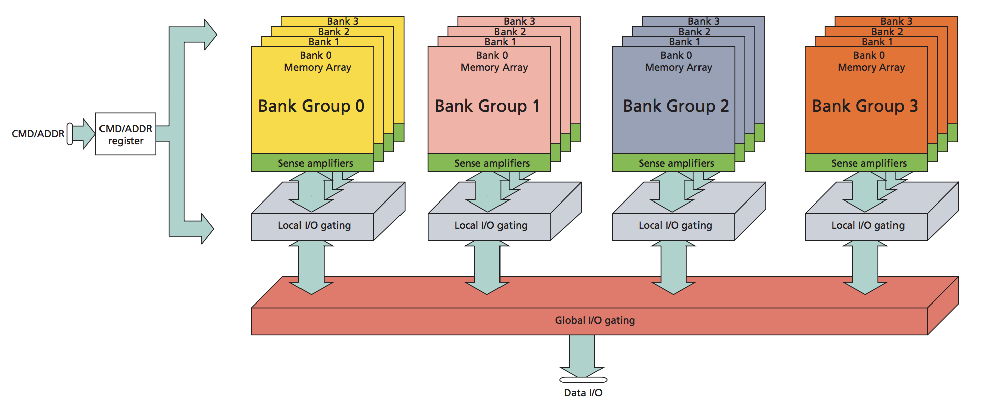

# What DDR memory is?
DDR stands for Double Data Rate memory.
It is a type of RAM (Random Access Memory) that transfers data on both rising edge and falling edge of clock.
Therefore in one cycle data is transferred twice, giving higer speed and better bandwidth comapred to Synchroniced DRAN.

For example if the clock frequency = 100 MHz

In SDRAM effective data rate will be 100 MT/s
but in DDR it will be 200 MT/s

## DDR memory contains:
  - Memory cells
  - Row decoder
  - Column decoder
  - Sense Amplifier
  - Banks
  - Control Logic
  - I/O buffers

## Organisatioon of DDR Memory
DDR memory is divided into banks and these banks contains rows and columns. data is accessed through row address and column address.

## Basic DDR Operations
  1. Activate Command
    Opens a row in a bank.
  2. Read Command
    Reads data from column.
  3. Write Command
    Writes data into memory.
  4. Precharge Command
    Closes currently opened row.
  5. Refresh Command
    Restores charge in memory capacitors.

## DDR timing Parameters 
  CAS Latency (CL): Delay between read command and output data.
  tRCD: Row to column delay.
  tRP: Precharge delay.
  tRAS: Minimum row active time.
  
Advantages of DDR Memory
  - Faster data transfer
  - High bandwidth
  - Efficient memory access
  - Suitable for high-speed systems

Applications of DDR Memory
  - Computers
  - FPGA systems
  - GPUs
  - Embedded systems
  - Servers
  - Networking devices
Basic Verilog code for showing data tranfer on both edges

           module basic_ddr(
                input clk,
                input data_rise,
                input data_fall,
                output reg q
          );

          always @(posedge clk)
              q <= data_rise;

          always @(negedge clk)
              q <= data_fall;
          endmodule

# DDR2 memory (Double data rate Synchronous DRAM 2nd Gen)
## What is DDR2 memory?
It is the second generation of DDR memory technology and is faster and more power efficient than basic DDR (discussed before). 
It also transferred data at falling and rising edge both but does it faster than DDR memory due to improved architecture.

Main difference between basic DDR and @nd gen DDR
| Feature           | DDR   | DDR2   |
| ----------------- | ----- | ------ |
| Voltage           | 2.5V  | 1.8V   |
| Prefetch          | 2-bit | 4-bit  |
| Speed             | Lower | Higher |
| Power Consumption | More  | Less   |
| Clock Frequency   | Lower | Higher |

DDR 2 fetches 4 bit at a time from memory cell, this improves bandwidth and speed.

## DDR2 memory organisation is similar to that of DDR with banks having rows and columns accessed by row decoder and column decoder.

DDR2 Commands
  1. ACTIVE
    Opens a row in a bank.
  2. READ
    Reads data from selected column.
  3. WRITE
    Stores data into selected column.
  4. PRECHARGE
    Closes active row.
  5. REFRESH
    Restores capacitor charge.
  6. NOP
    No operation.

### DDR2 Timing Parameters
CAS Latency (CL): Delay between READ command and output data.
tRCD: Delay between ACTIVE and READ/WRITE command.
tRP: Time required to close one row before opening another.
tRAS: Minimum time a row must stay active.

## DDR2 Read Operation
  1. ACTIVE row
  2. Wait tRCD
  3. READ command
  4. Wait CAS latency
  5. Data appears on DQ bus
     
## DDR2 Write Operation
  1. ACTIVE row
  2. Wait tRCD
  3. WRITE command
  4. Send data on DQ lines
  5. PRECHARGE row

## Burst transfer in DDR2
DDR2 usually transfers data in bursts. Which improves speed and bandwidth.

### What is burst ?
A burst means transferring multiple data values continuously after giving only one READ or WRITE command.
Instead of sending address again and again,
DDR memory automatically transfers consecutive data.
This makes memory transfer much faster.

We can see a example:
Without burstn :
READ Addr0 → Data0
READ Addr1 → Data1
READ Addr2 → Data2
READ Addr3 → Data3
multiple commands needed.

With burst:
READ Addr0
→ Data0 Data1 Data2 Data3
only 1 read command is given to get multiple data values.

IF,
Burst Length = 4 and
Start Address = 100
then ddr automatically transfers:
Addr100 → Data0
Addr101 → Data1
Addr102 → Data2
Addr103 → Data3

## Advantages of DDR2
  - Higher speed
  - Lower power usage
  - Better bandwidth
  - Improved signal integrity
  - Faster burst transfers

## Limitations of DDR2
  - More complex controller
  - Higher latency than DDR
  - Older technology now

