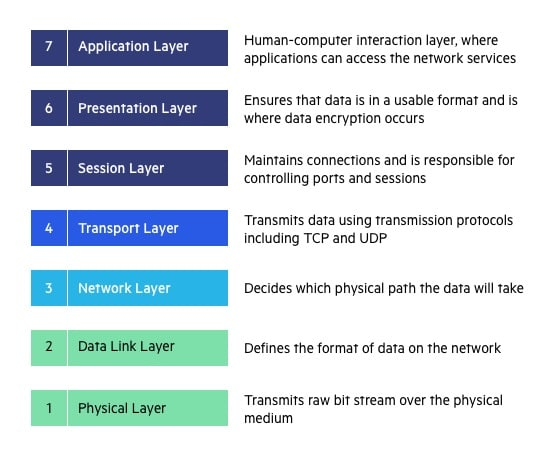
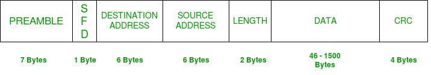
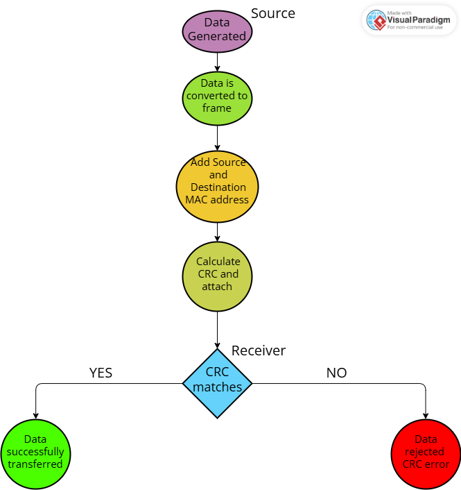

# Ethernet link layer 

### What us Ethernet?
It is a wired technology used to connect various devices within local network.
Eg. We can connect various computers via ethernet for fast transfer of data.
It defines how data is formatted transmitted and received between devices connected through cables such as twisted pair and fiber optic cables.

Ethernet operated at 
  - Physical layer and 
  - Data link layer
of Open Systems Interconnection (OSI) model which is a standardize 7 stage model use for networking functions, allowing diverse communication systems to communicate.

Daily Devices which use ethernet are computers, routers, FPGA boards etc.

## Why ethernet is used

  - Because it provides
    - High speed coomunicationa and data transfer.
    - Low cost
    - standardize data transfer protocols
    - Easy scalable
  - Main use of ethernet was seen in
    - Internet communication
    - Data centers
    - Industrial automation
    - FPGA based networking system

Here is a image giving a small brief of OSI model for refernece.

## What Ethernet link layer does?

It is responsible for
  - Framing data
  - MAC addressing
  - Error detection
  - Media access control

Data at this layer is refered as **Frame**

### **Ethernet Frame Structure**

Let's us look at frame structure one by one.

## Preamble
It is a 7 byte alternating pattern of 1's and 0's [1010101..] which gives a heads up to the reciving end about incoming data. It allows the sender and reciver to establish bit synchronization. It allows the receiver to lock onto the data stream before the actual frame begins.

## SFD - Start of frame delimiter 
It is a 1 byte field set to 10101011. It indicates the next bits are actual start of the frame after the preamble ends.

## Destination Address
[MAC address
It is a local address with all devices. A 48 bit hardware address assigned to all network devices.
Represented by 12 hexadecimal digits. 
Eg. 00:1B:2C:5D:3E:2A 
Ehternet has unicast which allows only send data to one MAC address
Multicast allows to send data to few specific devices
Broadcast will send data to every device on that network]

It is a 6 byte field containing  MAC address of the destination machine.

## Source Address
It is a 6 bytet field containing MAC address of the source machine. (The least significant bit of the first byte is always 0)

## Length 
It is a 2 byte field specifying length of the payload

## Data 
Also known as **payload** as actual transmitted data is inserted here.
Max payload = 1500 bytes 
Min payload = 46 byte (if data is less than min payload then 0 padding is used to match the criteria)

## CRC - Cyclic Redundancy Check
It is used for error deetection. 
Sender computes a checksum and attaches it to the fram the reciver would recalculte the checksum if both matches frame accepted otherwise discardes.

# How data is transfered in **Etherenet**?

1) Source will generate the data
2) Transport it to the network layer add a header 
3) Etherenet layer will convert this data into fram to transport.
4) Source and Destination MAC addresses are attached 
5) CRC is calculated and attahted 
6) Data travels through cable 
7) The reciving end will check CRC 
8) It is matches the data is successfully transferred if not then the data is rejected.

### There is switch whic store MAC table and forward data to correct port.

# Duplex mode
 There are two types of duplex
  1) Half Duplex allows only one direction at a time if multiple data needs to be transmit there will be collision
  2) Full Duplex allows 2 way communication, no collision and faster data transmmission.

# These collisions are detected by **CSMA/CD** protocol 

It will check if sender is ready to send the data and then send a dummy data on line if there is no collision real data will be transmitted but if there is a collision the system will jam the data. Wait for some time (random) again follow the same process.

This method slows down the transmission speed, hence it is not in work anymore mordern  ethernet uses Full Duplex with both way transmission.

 ## For data transfer the cables used are **Twisted pair cable** and **Fiber optic cable**

 # Limitations of Ethernet
  - Limited cable length
  - Possible damage to cable can cause whole network to shut down
  - Requires switches/routers for larger networks.

### Ethernet is one of the greatest wired technology prviding a high-speed and reliable data transfer using frame based communication at link layer. It's PHY (physical layer device) and MAC (media access control) interfaces together are foundation of many hardware application based on network communication

# Raw Socket

Applications communicate with each other using high level protocols such as TCP(Transfer control protocol) and UDP(User Datagram Protocol). Raw socket allows direct access to low-level network packets and ethernet frames.

Socket use to ocmmunicate with each other in raw socket we need to do all the operation manually that is..
You need to open each socket, build each layer, turn it into bytes, send the packet, recieve packet manually and handle it.

Raw socket bypass some operating system protocol processing.
Raw sockets allow programmers to:
  - Manually create packets
  - Access Ethernet headers
  - Read MAC addresses
  - Implement custom protocols
  - Analyze packets directly

## OS specific Socket settings

Different operating systems may require specific socket configurations while working with Ethernet communication and raw sockets.

### Linux socket settings

Linux provides direct support for raw Ethernet frames using **AF_PACKET**.

Features
- Direct access to Ethernet frames
- Can send and receive Layer-2 packets
- Mostly used for:
  - Packet sniffing
  - Custom protocols
  - Network analysis

### Example Socket Creation

    import socket 
    
    sock = socket.socket(socket.AF_PACKET, socket.SOCK_RAW, socket.ntohs(3))

Here 
- **AF_PACKET:** Access link layer packets directly
- **SOCK_RAW:** Raw socket type
- **socket.ntohs(3):** Receives all Ethernet protocols

To run this we need root access and administrator privileges 

### Windows Socket Settings

Windows does not support AF_Packet. It instead uses AF INET

Mostly working on 3-layer - IP Layer 

for raw ethernet access Npcan or WinPcap drivers are used.

### Example socket creation.

    import socket 
        
    sock = socket.socket(socket.AF_INET, socket.SOCK_RAW, socket.IPPROTO_IP)

Here,
-  `AF_INET`: Uses IPv4 addressing
- `SOCK_RAW`: Creates a raw socket
- `IPPROTO_IP` Accesses IP packets directly

Used mainly for packet monitoring and analysis

Requires Administrator privileges in Windows

### macOS Socket Settings

macOS uses BSD socket implementation.

Raw sockets are supported but have limited Ethernet frame access compared to Linux.

### Example socket creation.

    import socket 
    
    sock = socket.socket(socket.AF_INET, socket.SOCK_RAW, socket.IPPROTO_TCP)

Here,

- `AF_INET`: Uses IPv4 network communication
- `SOCK_RAW`: Creates a raw socket connection
- `IPPROTO_TCP`: Captures TCP protocol packets

BSD sockets are used internally in macOS

Administrator privileges may be required
