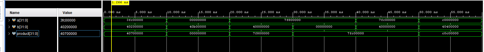

    (* keep_hierarchy = "yes" *)
    module fp32(
        input [31:0] a,
        input [31:0] b,
        output reg [31:0] product
    );
        wire sign1, sign2, sign;
        wire [7:0] es1, es2;
        wire [22:0] mantissa1, mantissa2;
    
        // Force Vivado to use DSP slices for this 24x24 multiplication
        (* use_dsp = "yes" *) reg [47:0] mantissa_product;
    
        reg [7:0] exponent_result;
        wire a_zero, b_zero, a_inf, b_inf, a_nan, b_nan;

        assign sign1 = a[31];
        assign es1 = a[30:23];
        assign mantissa1 = a[22:0];
        assign sign2 = b[31];
        assign es2 = b[30:23];
        assign mantissa2 = b[22:0];
        assign sign = sign1 ^ sign2;

        assign a_zero = (es1 == 8'd0) && (mantissa1 == 23'd0);
        assign b_zero = (es2 == 8'd0) && (mantissa2 == 23'd0);
        assign a_inf = (es1 == 8'b11111111) && (mantissa1 == 0);
        assign b_inf = (es2 == 8'b11111111) && (mantissa2 == 0);
        assign a_nan = (es1 == 8'b11111111) && (mantissa1 != 0);
        assign b_nan = (es2 == 8'b11111111) && (mantissa2 != 0);

        wire [8:0] e_sum_prior = es1 + es2;
        wire [7:0] e_sum = (e_sum_prior < 127) ? 8'b0 : e_sum_prior - 9'd127;

        always @(*) begin
            product = 32'd0;
            if (a_nan || b_nan) begin
                product = {1'b0, 8'b11111111, 23'h400000};
            end else if ((a_inf && b_zero) || (b_inf && a_zero)) begin
                product = {1'b0, 8'b11111111, 23'h400000};
            end else if (a_inf || b_inf) begin
                product = {sign, 8'b11111111, 23'd0};
            end else if (a_zero || b_zero) begin
                product = {sign, 8'd0, 23'd0};
            end else begin
                // This operation will now consume DSPs instead of 500+ LUTs
                mantissa_product = {1'b1, mantissa1} * {1'b1, mantissa2};
            
                if (mantissa_product[47]) begin
                    exponent_result = e_sum + 1;
                    product = {sign, exponent_result, mantissa_product[46:24]};
                end else begin
                    exponent_result = e_sum;
                    product = {sign, exponent_result, mantissa_product[45:23]};
                end
            end
        end
    endmodule

if exponent is 255 and mantissa is all 0's IEEE shows it as a special condition (+ve infinity)
if exponents is all 1's (255) and mantissa is any binary order but has one 1 it isa NaN.

32 bit IEEE 754 floating point multiplier.
This module extracts sign, exponent and mantissa fields and handles IEEE special cases. And give output in normalized form.

             a[31:0]                             b[31:0]
                 │                                   │
                 ▼                                   ▼
         ┌──────────────────┐                ┌──────────────────┐
         │  Field Extract   │                │  Field Extract   │
         │ (Sign, Exp, Mant)│                │ (Sign, Exp, Mant)│
         └─────────┬────────┘                └─────────┬────────┘
                   │                                   │
                   └─────────────────┬─────────────────┘
                                     │ (Sign, Exp, Mant bits)
                                     ▼
           ┌──────────────────────────────────────────────────────┐
           │               Special Case Detection                 │
           │        (Check for NaNs, Infs, Zeros, Denorms)        │
           └──────────────────────────┬───────────────────────────┘
                                      │
         ┌────────────────────────────┴────────────────────────┐
         │                                                     │
         ▼ (Exponents & Signs)                                 ▼ (Mantisand / Fractions)
    ┌─────────────────────────────────┐               ┌─────────────────────────────────┐
    │     Exponent Add & Bias Adjust  │               │           24x24 DSP             │
    │    Exp_out = Ea + Eb - 127      │               │      Mantissa Multiplier        │
    │    Sign_out = Sa ^ Sb           │               │   (Includes hidden 1-bit)       │
    └────────────────┬────────────────┘               └────────────────┬────────────────┘
                     │                                                 │
                     │              ┌──────────────────────────────────┘
                     │              │ (48-bit product)
                     ▼              ▼
      ┌──────────────────────────────────────────────────────┐
      │                    Normalization                     │
      │       (1-bit Right Shift if MSB=1 + Exp Adjust)      │
      │                & Rounding Control                    │
      └──────────────────────────┬───────────────────────────┘
                                 │
                                 ▼
      ┌──────────────────────────────────────────────────────┐
      │                     Result Pack                      │
      │             (IEEE-754 Format Assembly)               │
      └──────────────────────────┬───────────────────────────┘
                                 │
                                 ▼
                      ┌────────────────────────┐
                      │      product[31:0]     │          
                      └────────────────────────┘

## Using module 

Module is declared with input output and product.
a and b input with 32 bit width IEEE-754 floating point.
& output is product of a and b of 32 bit width.

Output is in IEEE 754 formate. 
Hvaing sign exponent and mantissa.

## Working principle.

    1) Extract fields:
        - sign bits 
        - exponents 
        - mantissa 

    2) Detect special cases
        - zero
        - infinity
        - NaN 
        - 0 x Infinity 
    3) computes sign using xor function using the extracted sign component.
    4) Add exponents 
        IEEE multiplicatoion rule: E1 + E2 - Bias(127)
    5) Multiply mantissas
       - (1.m1) × (1.m2) (24 bit x 24 bit multiplication with DSP slicing)
    6) Normalize result 
        - if the out come is 10.xxxx then the msb is at 47th bit and we need a right shift and to increaase exponent for normalizing. 
        - If 1.xxxx it is already normalized.
    7) Return output in IEEE formate {sign,exponent,mantissa}

## Advantages
- DSP Optimized
  (* use_dsp = "yes" *) allows vivado to map multiplication in DSP48 slice.
  resulting in faster operation, smaller luts and better timing.
- It handles IEEE important cases.
      - Zero
      - Infinity
      - NaN
      - Infinity × Zero

- No clk combinational circuit
                                 
 ## Limitations
 - IEEE rounding bits are not implemented.
 - subnormal numbers are not handled
 - exponent overflow should generate infinity not currently implemented.

# Testbench and explanation

Testbench

    `timescale 1ns / 1ps

    module tb_fp32;

        reg [31:0] a;
        reg [31:0] b;
        wire [31:0] product;

        fp32 uut (
            .a(a),
            .b(b),
            .product(product)
        );

        initial begin

            // Normal multiplication
            a = 32'h3FC00000; // 1.5
            b = 32'h40200000; // 2.5
            #10;

            // Zero multiplication
            a = 32'h00000000;
            b = 32'h40B00000; // 5.5
            #10;

            // Infinity multiplication
            a = 32'h7F800000; // +inf
            b = 32'h40000000; // 2
            #10;

            // Infinity × Zero
            a = 32'h7F800000;
            b = 32'h00000000;
            #10;

            // NaN input
            a = 32'h7FC00000;
            b = 32'h40000000;
            #10;

            // Negative multiplication
            a = 32'hC0000000; // -2
            b = 32'h40400000; // 3
            #10;

            $finish;
        end

    endmodule

expected results 
------------------------------------------
| case      | A     | B     | Result      |
-------------------------------------------
| Normal    | 1.5   |2.5    | 3.75        |
|     Zero  | 0     |5.5    | 0           |
| Infinity  | inf   |2      |inf          |
| Invalid   |inf    |0      | NaN         |
| NaN       | NaN   |2      |NaN          |
| Negative  | -2    | 3     | -6          |  
-------------------------------------------

                                 
                                 
                      

